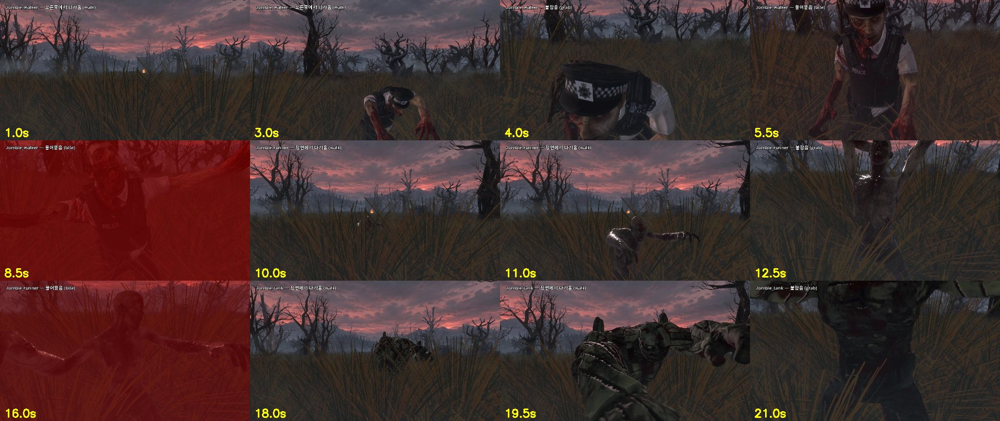
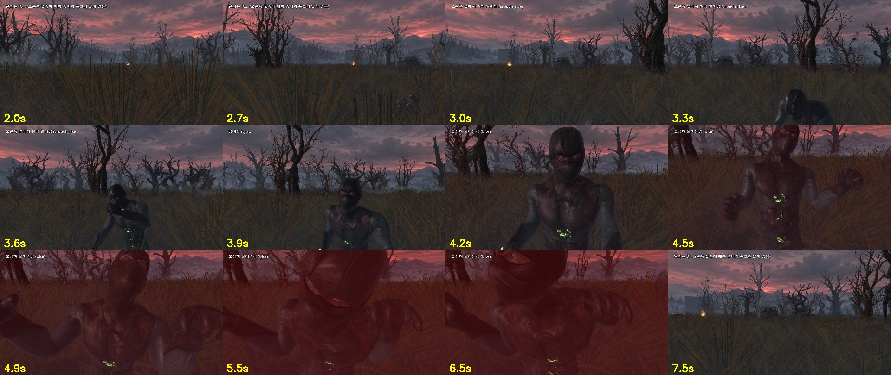

# WU-20b 근거 — 좀비 `grab`·`bite` (+ 탱커 `run`) (2026-09-30)

## 넣은 동작 (Mixamo, 이미 받아 둔 원본 — `art/source/mixamo/`, git 제외)
| 이름 | 원본 | 쓰는 곳 (PRD) | 대상 |
|---|---|---|---|
| `grab` | Zombie Attack (손을 뻗어 움켜쥠) | 붙잡기 F-31 | 4종 |
| `bite` | Zombie Neck Bite (목을 물어뜯음) | 칼 없을 때 물어뜯음 F-34 | 4종 |
| `run` | scary zombie pack · zombie run | 탱커 돌진 F-42 (B 가 느리게 재생) | 탱커 (워커·러너는 이미 있음) |

- 모두 **제자리**(In Place)로 변환 — 좀비 위치는 B 의 코드가 정한다
- 워커에 `run`, 러너에 `walk` 도 들어 있다 (전과 같음)

## 만든 방법
`art/blender/import_mixamo.py` 에 기존 동작 + `--anim grab="art/source/mixamo/Zombie Attack.fbx" --anim bite="art/source/mixamo/Zombie Neck Bite.fbx"`,
`--in-place` 에 `grab,bite` 추가 (탱커는 `--anim run=... --zombify 1.0` 도). 좀비별 나머지 옵션은 `docs/evidence/WU-20/` 와 같다.

## 검사 (`validate.py`) — 4종 통과
| 좀비 | 애니메이션 |
|---|---|
| walker | attack, bite, death, grab, hit, idle, run, walk |
| runner | attack, bite, death, grab, hit, idle, run, walk |
| tank | attack, bite, death, grab, hit, idle, run, walk |
| ambusher | attack, bite, crouch_idle, crouch_rise, death, getup, grab, hit, idle, scream, walk |

## 미리보기 (`scenes/stage/bite_preview.tscn`)
주인공 1인칭, 팀 스테이지 맵 위. 좀비 4종이 차례로 **정면·왼쪽·오른쪽 중 무작위 방향**에서 다가와
`walk → grab → bite` — 가까이 오면 그쪽으로 고개를 돌리고, 붙잡히면 시선이 좀비 얼굴 쪽으로 끌려가며 흔들리고, 물 때 붉게 번진다 (`sfx_zombie_scream`, `sfx_bite`).
화면 흔들림·붉은 화면은 확인용 연출이다 — 실제 게임 연출은 B(잡힘 WU-25)·C(화면) 가 정한다.

## 매복: 풀속에 쭈그려 있다가 옆에서 일어나 덤빔 (2026-09-30)
- 새 다운로드 없이 `getup`(누웠다 일어남)의 일부 구간을 잘라 두 동작을 만들었다 — `import_mixamo.py --clip`
  - `crouch_idle` = getup 47 - 52% (0.37초, 쭈그린 자세에서 꿈틀 — `LOOP_PINGPONG` 권장). 머리 높이 약 0.65 m → 허리 높이 풀에 숨는다
  - `crouch_rise` = getup 50 - 66% (1.20초, 쭈그린 채 → 선 자세)
- 잘라 낸 구간이 원래 시각(3.8초)부터 시작하던 문제 → glb 내보낼 때 `export_anim_slide_to_zero` (모든 동작 0초 시작)
- 미리보기 `scenes/stage/ambush_preview.tscn`: 주인공이 달리다 매복 좀비 옆(왼쪽·오른쪽 무작위)을 지나면
  `crouch_idle → crouch_rise(비명) → grab 으로 덤빔 → bite`. 주인공은 놀라 느려지고 그쪽으로 고개를 돌린다
- WU-20b 의 `lie_idle`(누워서 꿈틀) 대신 쓸 수 있다 — 게임에서 어느 쪽으로 숨길지는 B 가 정한다

## 남은 WU-20b 동작
`stabbed` `stagger` `lunge` `walk_b` `walk_c` `death_b` — 아직 없음 (B 는 "못 구하면" 칸의 대체 동작 사용)
