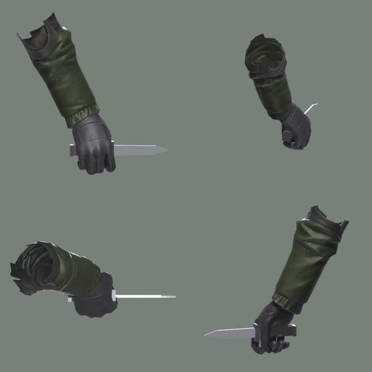
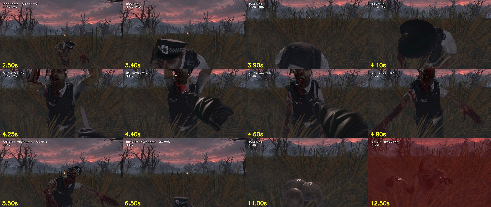

# 근거 — 칼로 좀비를 물리치는 동작 (A 담당분: 모델·시범 동작, 2026-09-30)

PRD F-30 "칼 1자루, 1회용" · F-32 "칼로 좀비를 찌르고 탈출한다. 칼은 사라진다" · F-35 "칼을 쓰면 아이콘이 사라진다".
실제 잡힘·탈출 로직은 B 의 `grab_system.gd` (WU-25). A 는 모델과 시범 동작을 만든다.

## 1. 칼을 쥔 오른손 (`godot/assets/models/weapon_knife.glb`)
- 권총에 쓴 Mixamo `Swat` 오른손 주먹을 그대로 가져와, 주먹 구멍이 칼 손잡이 축과 맞게 돌렸다 (`make_pistol.py --knife-from`)
- 물체 `Knife` `HandRight`. 칼 원점 = 손잡이, 칼끝 = Godot -Z 는 그대로 (TECH_SPEC 13.3.1)
- `validate.py` 통과: 칼 길이 0.251 m (손 제외), 삼각형 1,392

## 2. 좀비 `stabbed` (칼에 찔려 쓰러짐) — 4종
- Mixamo `Dying` (이미 받아 둔 원본) → `stabbed`, 제자리. WU-20b 1순위 목록 항목

## 3. 시범 동작 `scripts/stage/knife_motion.gd` (B 가 가져다 쓴다)
| | |
|---|---|
| `stab(좀비 목 위치)` | 아래에서 칼을 치켜듦 → 목을 찌름 → 비틀어 뽑음 → 내려가며 사라짐 (약 0.9초) |
| `hit` 신호 | 칼이 박히는 순간 — 여기서 `hit_blood.play(1.5)`, `sfx_knife`, 좀비 `stabbed` |
| `finished` 신호 | 칼이 사라진 뒤 — 풀려남. 칼은 1회용이라 다시 보이지 않는다 |

## 4. 미리보기 `scenes/stage/knife_preview.tscn`
좀비가 무작위 방향에서 다가와 붙잡음 → **칼이 있으면** 찔러서 쓰러뜨리고 탈출, 칼이 사라짐(화면 "칼: 없음") →
다음 좀비는 **칼이 없어** 물어뜯김 → 칼을 다시 받고 반복.

